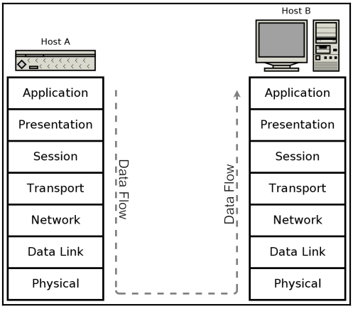
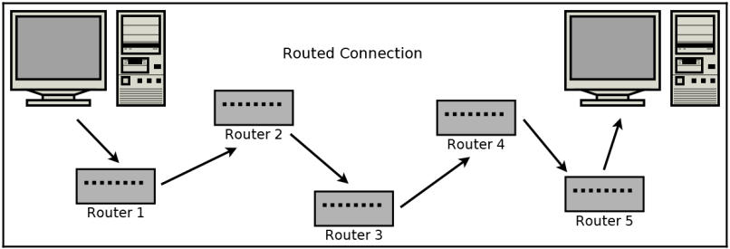
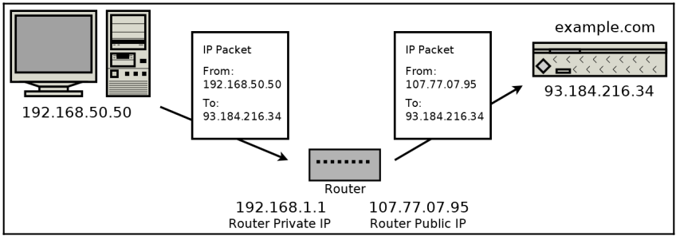
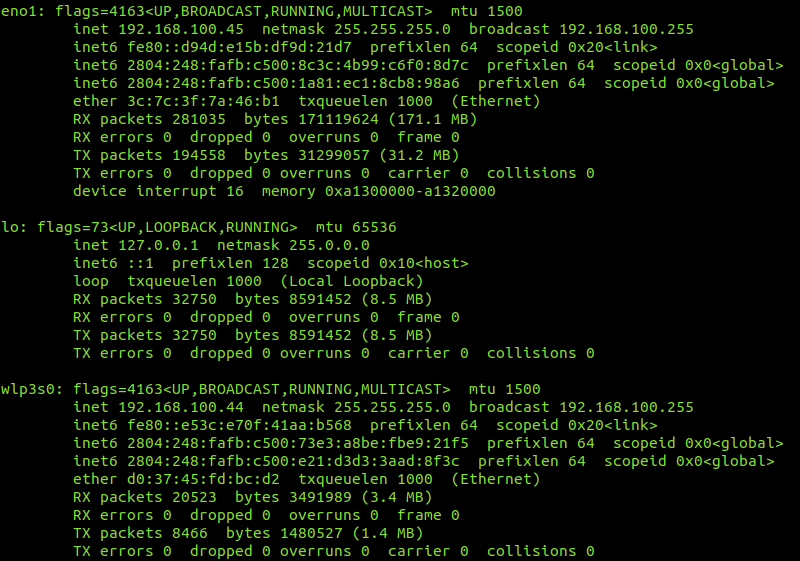

<h1>Study of Sockets in C</h1>

Repository for the study of C Sockets and Computer Networks principles. The most of the text here is summarized from the [references](#references).

---

<h2>Index</h2>

- [Dependencies](#dependencies)
- [Usage](#usage)
- [Introduction to Networks and Protocols](#introduction-to-networks-and-protocols)
  - [OSI Layer model](#osi-layer-model)
  - [TCP/IP layer model](#tcpip-layer-model)
  - [Data encapsulation](#data-encapsulation)
  - [Internet Protocol](#internet-protocol)
    - [Addresses](#addresses)
      - [IPv4](#ipv4)
      - [IPv6](#ipv6)
  - [Domain names](#domain-names)
    - [AAAA and A records](#aaaa-and-a-records)
  - [Internet routing](#internet-routing)
    - [Gateway](#gateway)
  - [Locak networks and address translation](#locak-networks-and-address-translation)
  - [Subnetting and CIDR](#subnetting-and-cidr)
  - [Multicast, broadcast, and anycast](#multicast-broadcast-and-anycast)
  - [Port numbers](#port-numbers)
  - [Clients and servers](#clients-and-servers)
  - [Putting it together](#putting-it-together)
  - [What's your address?](#whats-your-address)
  - [Listing network adapters from C](#listing-network-adapters-from-c)
- [References](#references)

---

# Dependencies

- C Compiler (GCC for Unix-based systems) or (MinGW of Windows);

---

# Usage

Choose the source module to display on `src/main.c`, uncomment it and comment the rest. Then, compile the project with:

```shell
$ make
```

Finally, run with:

```shell
$ make run
```

Or

```shell
$ ./bin/main
```

---

# Introduction to Networks and Protocols

## OSI Layer model

It's clear that if all of the disparate devices composing the internet are going to communicate seamlessly, there must be agreed-upon standards that define their communications. These standards are called protocols. Protocols define everything from the voltage levels on an Ethernet cable to how a JPEG image is compressed on a web page.

One common method of breaking down the problem is to place levels of concern into layers. Each layer then provides services for the layer on top of it, and each upper layer can rely on the layers underneath it without concern for how they work.

The most popular layer system for networking is called the **Open Systems Interconnection** model (OSI model). It was standardized in 1977 and is published as ISO 7498. It has seven layers:

<div align="center">


</div>

 - **Physical (1)**: This is the level of physical communication in the real world. At this level, we have specifications for things such as the voltage levels on an Ethernet cable, what each pin on a connector is for, the radio frequency of Wi-Fi, and the light flashes over an optic fiber.
 - **Data Link (2)**: This level builds on the physical layer. It deals with protocols for directly communicating between two nodes. It defines how a direct message between nodes starts and ends (framing), error detection and correction, and flow control.
 - **Network layer (3)**: The network layer provides the methods to transmit data sequences (called packets) between nodes in different networks. It provides methods to route packets from one node to another (without a direct physical connection) by transferring through many intermediate nodes. This is the layer that the Internet Protocol is defined on, which we will go into in some depth later.
 - **Transport layer (4)**: At this layer, we have methods to reliably deliver variable length data between hosts. These methods deal with splitting up data, recombining it, ensuring data arrives in order, and so on. The Transmission Control Protocol (TCP) and User Datagram Protocol (UDP) are commonly said to exist on this layer.
 - **Session layer (5)**: This layer builds on the transport layer by adding methods to establish, checkpoint, suspend, resume, and terminate dialogs.
 - **Presentation layer (6)**: This is the lowest layer at which data structure and presentation for an application are defined. Concerns such as data encoding, serialization, and encryption are handled here.
 - **Application layer (7)**: The applications that the user interfaces with (for example, web browsers and email clients) exist here. These applications make use of the services provided by the six lower layers.

It should be noted that chunks of data are often referred to by different names depending on the OSI layer they're on. A data unit on layer 2 is called a frame, since layer 2 is responsible for framing messages. A data unit on layer 3 is referred to as a packet, while a data unit on layer 4 is a segment if it is part of a TCP connection or a datagram if it is a UDP message.

## TCP/IP layer model

The **TCP/IP protocol suite** is the most common network communication model in use today. The TCP/IP reference model differs a bit from the OSI model, as it has only four layers instead of seven.

<div align="center">


</div>

- **Network Access layer (1)**: On this layer, physical connections and data framing happen. Sending an Ethernet or Wi-Fi packet are examples of layer 1 concerns.
- **Internet layer (2)**: This layer deals with the concerns of addressing packets and routing them over multiple interconnection networks. It's at this layer that an IP address is defined.
- **Host-to-Host layer (3)**: The host-to-host layer provides two protocols, TCP and UDP, which we will discuss in the next few chapters. These protocols address concerns such as data order, data segmentation, network congestion, and error correction.
- **Process/Application layer (4)**: The process/application layer is where protocols such as HTTP, SMTP, and FTP are implemented. Most of the programs that feature in this book could be considered to take place on this layer while consuming functionality provided by our operating system's implementation of the lower layers.

## Data encapsulation

When communicating over a network, data must be processed down through the layers at the sender and up again through the layers at the receiver. For example, if we have a web server, Host A, which is transmitting a web page to the receiver, Host B, it may look like this:

<div align="center">



</div>

The web page contains a few paragraphs of text, but the web server doesn't only send the text by itself. For the text to be rendered correctly, it must be encoded in an HTML structure.
In some cases, the text is already preformatted into HTML and saved that way but, in this example, we are considering a web application that dynamically generates the HTML, which is the most common paradigm for dynamic web pages. As the text cannot be transmitted directly, neither can the HTML. It instead must be transmitted as part of an HTTP response. The web server does this by applying the appropriate HTTP response header to the HTML.
The HTTP is transmitted as part of a TCP session. This isn't done explicitly by the web server, but is taken care of by the operating system's TCP/IP stack.
The TCP packet is routed by an IP packet.
This is transmitted over the wire in an Ethernet packet (or another protocol)

<div align="center">


</div>

## Internet Protocol

Twenty years ago, there were many competing networking protocols. Today, one protocol is overwhelmingly common—the Internet Protocol. It comes in two versions—IPv4 and IPv6. IPv4 is completely ubiquitous and deployed everywhere. If you're deploying network code today, you must support IPv4 or risk that a significant portion of your users won't be able to connect.

### Addresses

#### IPv4

IPv4 uses 32-bit addresses, which limits it to addressing no more than $ 2^{32} $ or 4,294,967,296 systems. However, these 4.3 billion addresses were not initially assigned efficiently, and now many Internet Service Providers (ISPs) are forced to ration IPv4 addresses.

All Internet Protocol traffic routes to an address. This is similar to how phone calls must be dialed to phone numbers. IPv4 addresses are 32 bits long. They are commonly divided into four 8-bit sections. Each section is displayed as a decimal number between 0 and 255 inclusive and is delineated by a period.

IPv4 addresses examples:

0.0.0.0
127.0.0.1
10.0.0.0
172.16.0.5
192.168.0.1
192.168.50.1
255.255.255.255

A special address, called the **loopback** address, is reserved at 127.0.0.1. This address essentially means establish a connection to myself. Operating systems short-circuit this address so that packets to it never enter the network but instead stay local on the originating system.

IPv4 reserves some address ranges for private use. If you're using IPv4 through a router/[NAT](#locak-networks-and-address-translation), then you are likely using an IP address in one of these ranges. These reserved private ranges are as follows:

10.0.0.0 to 10.255.255.255
172.16.0.0 to 172.31.255.255
192.168.0.0 to 192.168.255.255

The concept of IP address ranges is a useful one that comes up many times in networking. It's probably not surprising then that there is a shorthand notation for writing them. Using **Classless Inter-Domain Routing (CIDR)** notation, we can write the three previous address ranges as follows:

10.0.0.0/8
172.16.0.0/12
192.168.0.0/16

CIDR notation works by specifying the number of bits that are fixed. For example, 10.0.0.0/8 specifies that the first eight bits of the 10.0.0.0 address are fixed, the first eight bits being just the first 10.

#### IPv6

IPv6 was designed to replace IPv4 and has been standardized by the Internet Engineering Task Force (IETF) since 1998. It uses a 128-bit address, which allows it to address a theoretical $ 2^{128} $ = 340,282,366,920,938,463,463,374,607,431,768,211,456, or about a $ 3.4 * 10^{38} $ addresses.

IPv6 addresses are 128 bits long. They are written as eight groups of four hexadecimal characters delineated by colons. A hexadecimal character can be from 0-9 or from a-f. Here
are some examples of IPv6 addresses:

0000:0000:0000:0000:0000:0000:0000:0001
2001:0db8:0000:0000:0000:ff00:0042:8329
fe80:0000:0000:0000:75f4:ac69:5fa7:67f9
ffff:ffff:ffff:ffff:ffff:ffff:ffff:ffff

There are a couple of rules for shortening IPv6 addresses to make them easier. Rule 1 allows for the leading zeros in each section to be omitted (for example, 0db8 = db8 ). Rule 2 allows for consecutive sections of zeros to be replaced with a double colon ( :: ). Rule 2 may only be used once in each address; otherwise, the address would be ambiguous. Applying both rules, the preceding addresses can be shortened as follows:

::1
2001:db8::ff00:42:8329
fe80::75f4:ac69:5fa7:67f9
ffff:ffff:ffff:ffff:ffff:ffff:ffff:ffff

Like IPv4, IPv6 also has a loopback address. It is ::1.

Dual-stack implementations also recognize a special class of IPv6 address that map directly to an IPv4 address. These reserved addresses start with 80 zero bits, and then by 16 one bits, followed by the 32-bit IPv4 address. Using CIDR notation, this block of address is ::ffff:0:0/96.

These mapped addresses are commonly written with the first 96 bits in IPv6 format followed by the remaining 32 bits in IPv4 format. Here are some examples:

| IPv6 Address | Mapped IPv4 Address |
|--------------|---------------------|
| ::ffff:10.0.0.0 | 10.0.0.0 |
| ::ffff:172.16.0.5 | 172.16.0.5 |
| ::ffff:192.168.0.1 | 192.168.0.1 |
| ::ffff:192.168.50.1 | 192.168.50.1 |

Another address type that you should be familiar with are link-local addresses. Link-local addresses are usable only on the local link. Routers never forward packets from these addresses. They are useful for a system to accesses auto-configuration functions before having an assigned IP address. Link-local addresses are in the IPv4 169.254.0.0/16 address block or the IPv6 fe80::/10 address block.

## Domain names

The Internet Protocol can only route packets to an IP address, not a name. So, if you try to connect to a website, such as example.com , your system must first resolve that domain name, example.com , into an IP address for the server that hosts that website. This is done by connecting to a **Domain Name System (DNS)** server. You connect to a domain name server by knowing in advance its IP address. The IP address for a domain name server is usually assigned by your ISP.

To resolve a hostname, your computer sends a UDP message to your domain name server and asks it for an *AAAA-type record for the domain you're trying to resolve. If this record exists, an IPv6 address is returned. You can then connect to a server at that address to load the website. If no AAAA record exists, then your computer queries the server again, but asks for an A record. If this record exists, you will receive an IPv4 address for the server. In many cases, a site will publish an A record and an AAAA record that route to the same server.

### AAAA and A records

> An AAAA record maps a domain name to the IPv6 of the computer hosting the domain. An AAAA record is used to find the IP address of a computer connected to the internet from a name. The AAAA record is conceptually similar to the A record, but it allows you to specify the IPv6 address of the server, rather than the IPv4.

It is also possible, and common, for multiple records of the same type to exist, each pointing to a different address. This is useful for redundancy in the case where multiple servers can provide the same service.

## Internet routing

The internet today has an estimated 20 billion devices connected. When you make a connection over the internet, your data first transmits to your local router. From there, it is transmitted to another router, which is connected to another router, and so on. Eventually, your data reaches a router that is connected to the receiving device, at which point, the data has reached its destination:



Imagine that each router in the preceding diagram is connected to tens, hundreds, or even thousands of other routers and systems. It's an amazing feat that IP can discover the correct path and deliver traffic seamlessly.

Unix-based systems includes some utilities as *traceroute6* and *tracepath*, where you can list the routers between your system and the destination system. Example:

- For IPv6:

```shell
$ traceroute6 example.com
```

- For IPv4:

```shell
$ tracepath -4 example.com
```

### Gateway

> A computer that sits between different networks or applications. The gateway converts information, data or other communications from one protocol or format to another. A router may perform some of the functions of a gateway. An Internet gateway can transfer communications between an enterprise network and the Internet.

As you can see if you run the commands, there are some hops between our system and the destination system. The IP addresses are listed for many of these intermediate routers, but a few are missing with the "no reply" message. This usually means that the system in question doesn't support the part of the **Internet Control Message Protocol (ICMP)** protocol needed. It's not unusual to see a few such systems when running tracert. Some of them have the "_gateway" message, meaning that this endpoint consist in a [gateway](#gateway).

## Locak networks and address translation

It's common for households and organizations to have small Local Area Networks (LANs). As mentioned previously, there are IPv4 addresses ranges reserved for use in these small local networks.

When a packet originates from a device on an IPv4 local network, it must undergo **Network Address Translation (NAT)** before being routed on the internet. A router that implements NAT remembers which local address a connection is established from.

The devices on the same LAN can directly address one another by their local address. However, any traffic communicated to the internet must undergo address translation by the router. The router does this by modifying the source IP address from the original private LAN IP address to its public internet IP address:



Network address translation can be more complicated than it first appears. In addition to modifying the source IP address in the packet, it must also update the checksums in the packet. Otherwise, the packet would be detected as containing errors and discarded by the next router. The NAT router must also remember which private IP address sent the packet in order to route the reply. Without remembering the translation address, the NAT router wouldn't know where to send the reply to on the private network.

NATs will also modify the packet data in some cases. For example, in the **File Transfer Protocol (FTP)**, some connection information is sent as part of the packet's data. In these cases, the NAT router will look at the packet's data in order to know how to forward future incoming packets. IPv6 largely avoids the need for NAT, as it is possible (and common) for each device to have its own publicly-addressable address.

## Subnetting and CIDR

IP addresses can be split into parts. The most significant bits are used to identify the network or subnetwork, and the least significant bits are used to identify the specific device on the network.

IPv4 traditionally uses a mask notation to identify the IP address parts. For example, consider a router on the 10.0.0.0 network with a subnet mask of 255.255.255.0. This router can take any incoming packet and perform a **bitwise AND** operation with the **subnet mask** to determine whether the packet belongs on the local subnet or needs to be forwarded on.

For example, this router receives a packet to be delivered to **10.0.0.105**. It does a bitwise AND operation on this address with the subnet mask of **255.255.255.0**, which produces **10.0.0.0**. That matches the subnet of the router, so the traffic is **local**. If, instead, we consider a packet destined for **10.0.15.22**, the result of the bitwise AND with the subnet mask is **10.0.15.0**. This address doesn't match the subnet the router is on, and so it must be **forwarded**.

IPv6 uses CIDR. Networks and subnetworks are specified using the CIDR notation we described earlier. For example, if the IPv6 subnet is /112 , then the router knows that any address that matches on the first 112 bits is on the local subnet.

## Multicast, broadcast, and anycast

When a packet is routed from one sender to one receiver, it uses **unicast** addressing. This is the simplest and most common type of addressing.

**Broadcast** addressing allows a single sender to address a packet to all recipients simultaneously. It is typically used to deliver a packet to every receiver on an entire subnet.

If a broadcast is a one-to-all communication, then **multicast** is a one-to-many communication. Multicast involves some group management, and a message is addressed and delivered to members of a group.

**Anycast** addressed packets are used to deliver a message to one recipient when you don't care who that recipient is. This is useful if you have several servers that provide the same functionality, and you simply want one of them (you don't care which) to handle your request.

It's worth noting that these alternative addressing methods don't generally work over the broader internet. Imagine if one peer was able to broadcast a packet to every connected internet device. It would be a mess!

If you can use IP multicasting on your local network, though, it is worthwhile to implement it. Sending one IP level multicast conserves bandwidth compared to sending the same unicast message multiple times. However, multicasting is often done at the application level. That is, when the application wants to deliver the same message to several recipients, it sends the message multiple times – once to each recipient.

## Port numbers

Generally, an IP address gets a packet routed to a specific system, but a port number is used to route the packet to a specific application on that system. For example, on your system, you may be running multiple web browsers, an email client, and a video-conferencing client. When your computer receives a TCP segment or UDP datagram, your operating system looks at the destination port number in that packet. That port number is used to look up which application should handle it.

Port numbers are stored as unsigned 16-bit integers. This means that they are between 0 and 65,535 inclusive.

| Port Number | Transport Protocol | Application Protocol |
|-------------|--------------------|--------------------- |
| 20, 21 | TCP | File Transfer Protocol (FTP) |
| 22 | TCP | Secure Shell (SSH) |
| 23 | TCP | Telnet |
| 25 | TCP | Simple Mail Transfer Protocol (SMTP) |
| 53 | UDP | Domain Name System (DNS) |
| 80 | TCP | Hypertext Transfer Protocol (HTTP) |
| 110 | TCP | Post Office protocol, V3 (POP3) |
| 143 | TCP | Internet Message Access Protocol (IMAP) |
| 194 | TCP | Internet Relay Chat (IRC) |
| 443 | TCP | HTTP over TLS/SSL (HTTPS) |
| 993 | TCP | IMAP over TLS/SSL (IMAPS) |
| 995 | TCP | POP3 over TLS/SSL (POP3S) |

Each of these listed port numbers is assigned by the **Internet Assigned Numbers Authority (IANA)**. They are responsible for the official assignments of port numbers for specific protocols. Unofficial port usage is very common for applications implementing custom protocols. In this case, the application should try to choose a port number that is not in common use to avoid conflict.

## Clients and servers

There is also a common paradigm in networking called the **client-server** model. In this model, a server listens for connections. The client, knowing the address and port number that the server is listening on, establishes the connection by sending the first packet. For example, the web server at example.com listens on port 80 (HTTP) and port 443 (HTTPS). A web browser (client) must establish the connection by sending the first packet to the web server address and port.

## Putting it together

A **socket** is one end-point of a communication link between systems. It's an abstraction in which your application can send and receive data over the network, in much the same way that your application can read and write to a file using a file handle.

An open socket is uniquely defined by a 5-tuple consisting of the following:

- Local IP address
- Local port
- Remote IP address
- Remote port
- Protocol (UDP or TCP)

This 5-tuple is important, as it is how your operating system knows which application is responsible for any packets received. For example, if you use two web browsers to establish two simultaneous connections to example.com on port 80 , then your operating system keeps the connections separate by looking at the local IP address, local port, remote IP address, remote port, and protocol. In this case, the local IP addresses, remote IP addresses, remote port ( 80 ), and protocol (TCP) are identical.

The deciding factor then is the local port (also called the **ephemeral port**), which will have been chosen to be different by the operating system for connection. This 5-tuple is also important to understand how NAT works. A private network may have many systems accessing the same outside resource, and the router NAT must store this five tuple for each connection in order to know how to route received packets back into the private network.

## What's your address?

You can find your IP address using the the ifconfig (deprecated) or ip addr commands on Unix-based systems (such as Linux and macOS).

```shell
$ ifconfig
```

or

```shell
$ ip addr
```

The example output:



These commands, ifconfig, ip addr, and ipconfig (Windows), show the IP address or addresses for each adapter on your computer. You may have several. If you are on a local network, the IP addresses you see will be your local private network IP addresses.

If you are behind a NAT, there is often no good way to know your public IP address. Usually, the only resort is to contact an internet server that provides an API that informs you of your IP address. A few free and public APIs for this are as follows:

- http://api.ipify.org/
- http://helloacm.com/api/what-is-my-ip-address/
- http://icanhazip.com/
- http://ifconfig.me/ip

By command line:

```shell
$ curl api.ipify.org
```

## Listing network adapters from C

Sometimes, it is useful for your C programs to know what your local address is. 

See the [code](src/unix_list.c) and its explainations.

To compile and run it, do:

```shell
$ mkdir bin
$ gcc src/*.c -I include -o bin/main
$ ./bin/main
```

---

# References

[1] WINKLE, L. V. (2019). *Hands-On Network Programming with C: Learn socket programming in C and write secure and optimized network code*. Mumbai, Packt.

[2] KUROSE, J. F., & ROSS, K. W. (2014). *Computer networking: a top-down approach featuring the Internet*. São Paulo, Pearson.

[3] https://github.com/codeplea/Hands-On-Network-Programming-with-C
